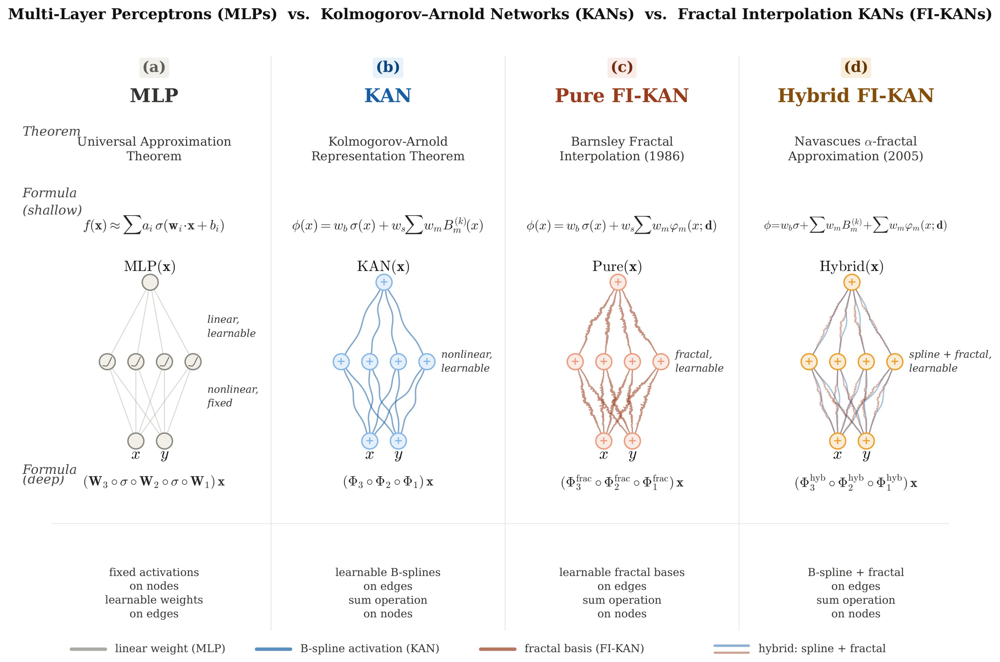

# FI-KAN: Fractal Interpolation Kolmogorov-Arnold Networks

<p align="center">
  
</p>

<p align="center">
  <b>Figure 1:</b> MLPs vs. KANs vs. FI-KANs. <b>(a)</b> MLP: scalar weights on edges, fixed activations on nodes.
  <b>(b)</b> KAN: learnable B-spline functions on edges.
  <b>(c)</b> Pure FI-KAN: replaces B-splines with fractal interpolation bases &phi;<sub>m</sub>(x; <b>d</b>).
  <b>(d)</b> Hybrid FI-KAN: retains B-splines and adds a fractal correction (f<sub>b</sub><sup>&alpha;</sup> = b + h).
  When <b>d</b> = <b>0</b>, (d) reduces to (b).
</p>

---

This repository provides a reference implementation of **Fractal Interpolation KAN (FI-KAN)**,
a neural architecture that incorporates **learnable fractal interpolation function (FIF) bases**
from iterated function system (IFS) theory into the Kolmogorov-Arnold Network (KAN) framework.

FI-KAN introduces basis functions with a **learnable fractal dimension** that adapts to the
regularity of the target function during training, providing a continuous, differentiable
knob from smooth (dim_B = 1) to fractal (dim_B > 1) edge geometry.

Two variants are provided:

- **Pure FI-KAN** (Barnsley framework): replaces B-splines entirely with FIF bases.
- **Hybrid FI-KAN** (Navascues framework): retains the B-spline path and adds a learnable
  fractal correction, implementing the alpha-fractal decomposition f_b^alpha = b + h.

The architecture is particularly suited for function approximation targets with non-trivial
Holder regularity, fractal self-similarity, or structured roughness inherited from PDE
operators (corner singularities, rough coefficients, stochastic forcing).

---

## Paper

**FI-KAN: Fractal Interpolation Kolmogorov-Arnold Networks**
**Gnankan Landry Regis N'guessan**

The preprint is available on arXiv.

---

## Key idea

Standard KAN uses B-spline basis functions that are near-optimal for smooth targets
but operate at a single resolution with no intrinsic multi-scale decomposition.
For targets with box-counting dimension dim_B > 1 (turbulence fields, fracture surfaces,
natural terrain, rough PDE solutions), smooth bases are fundamentally mismatched.

FI-KAN resolves this by:

1. Embedding fractal interpolation function (FIF) bases (Barnsley, 1986) into KAN edges,
2. Treating the IFS contraction parameters {d_i} as differentiable, trainable quantities,
3. Providing a fractal dimension regularizer (geometry-aware Occam's razor) that penalizes
   unnecessary fractal complexity,
4. Learning both the interpolation ordinates (what values to hit) and the inter-grid-point
   geometry (how rough the interpolation should be).

When d = 0, FIF bases reduce to piecewise linear hat functions (Pure) or the architecture
reduces exactly to standard KAN (Hybrid). The network develops fractal structure only
where the data demands it.

---

## Architecture variants

- **Pure FI-KAN** (Barnsley framework): all-fractal bases, strongest on rough targets.
  When d = 0: order-1 spline KAN.
- **Hybrid FI-KAN** (Navascues framework): spline backbone + fractal correction.
  When d = 0, w_frac = 0: reduces to standard KAN.
  Recommended as the default variant with K = 2 (fractal depth).

Baselines include efficient-KAN (Blealtan, MIT License) and parameter-matched MLP.

---

## Key results

| Target | KAN MSE | Hybrid FI-KAN MSE | Improvement |
|--------|---------|-------------------|-------------|
| Sawtooth (dim_B = 1.5) | 2.04e-3 | 3.9e-5 | **52x** |
| Rough-coeff diffusion (H=0.3) | 1.19e-3 | 1.50e-5 | **79x** |
| L-shaped corner singularity | 2.89e-3 | 8.35e-4 | **3.5x** |
| Holder alpha=1.5 | 1.58e-3 | 4.8e-5 | **33x** |
| Continual learning | 0.120 | 0.038 | **3.2x** |

On smooth targets (polynomial, exp sin), Hybrid FI-KAN remains competitive or superior
(up to 235x improvement on polynomial). Pure FI-KAN underperforms on smooth targets by
design, confirming the regularity-matching hypothesis.

---

## Install

```bash
pip install -r requirements.txt
pip install -e .
```

For PDE benchmarks (scikit-fem, fbm):
```bash
pip install scikit-fem fbm scipy
```

## Quickstart

Fit the Takagi sawtooth function (dim_B = 1.5):

```bash
python quickstart_fit_sawtooth.py
```

## What is inside

- `bases.py`: fractal interpolation basis function evaluation via truncated
  Read-Bajraktarevic iteration (Algorithm 1), box-counting dimension computation
- `layers.py`: `PureFIKANLinear` (Barnsley framework), `HybridFIKANLinear`
  (Navascues framework) with learnable contraction parameters, fractal dimension
  regularizer, and fractal energy ratio diagnostic
- `models.py`: `PureFIKAN`, `HybridFIKAN` (multi-layer network wrappers)
- `baselines.py`: efficient-KAN (Blealtan, MIT), MLP with parameter matching
- `targets.py`: Weierstrass, Takagi sawtooth, Holder family, Ackley 2D,
  multiscale, chirp, and smooth benchmarks
- `training.py`: multi-seed training loop with fractal dimension tracking
- `benchmarks.py`: PDE data generators (L-shaped domain FEM, rough-coefficient
  diffusion FEM, stochastic heat equation, fractal terrain, fBm paths,
  rough volatility)

## Usage example

```python
import torch
from models import HybridFIKAN
from training import train_model

device = "cuda" if torch.cuda.is_available() else "cpu"

# Create Hybrid FI-KAN: [input_dim, hidden, output_dim]
model = HybridFIKAN(
    [1, 16, 1],
    grid_size=8,
    spline_order=3,
    fractal_depth=2,    # K=2 recommended (Section 5.9)
    d_init_std=0.01,
).to(device)

# Train on your data
result = train_model(
    model, x_train, y_train, x_test, y_test,
    epochs=500, lr=1e-3,
    reg_frac=0.001,              # fractal dimension regularization
    model_type='fikan_hybrid',
)

# Inspect learned fractal dimensions
for i, d in enumerate(model.fractal_dimensions()):
    print(f"Layer {i}: dimB = {d.mean().item():.4f}")

# Inspect fractal energy ratio (rho ~ 0: spline-dominated)
for i, rho in enumerate(model.fractal_energy_ratios()):
    print(f"Layer {i}: rho = {rho:.4f}")
```

## Citation

Will be updated soon.

## License

MIT
